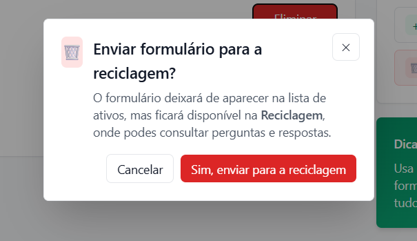
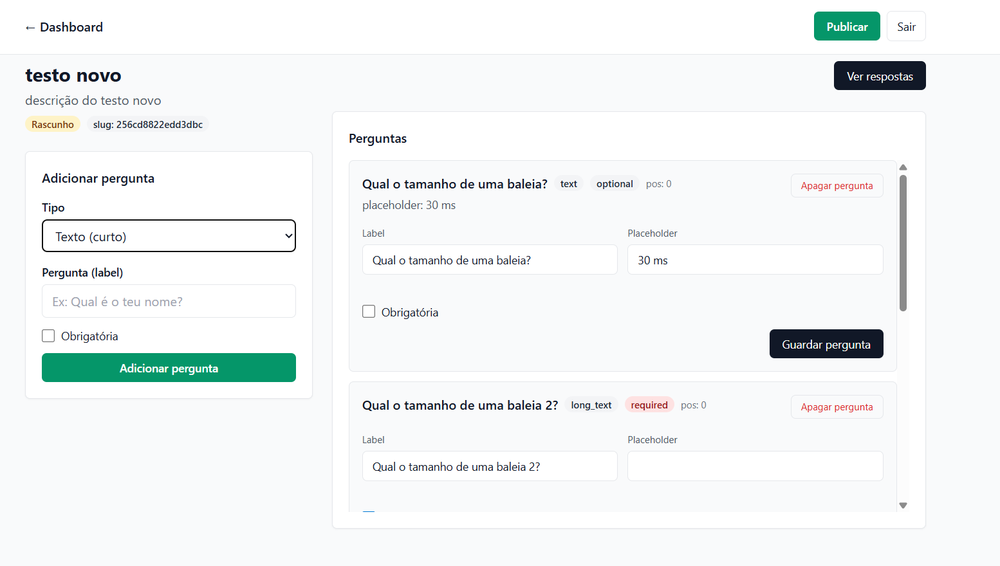

# 📋 Sistema de Marcação / Mini Forms

Plataforma web simples, moderna e segura para **criação de formulários e marcação de pedidos**, desenvolvida em **PHP + MySQL**, com frontend em **HTML, JavaScript e Bootstrap/Tailwind**, pensada para funcionar em **XAMPP, Hostinger ou outros hostings PHP**.

O sistema permite que utilizadores preencham formulários públicos e que o administrador acompanhe, controle e visualize o histórico completo das marcações.

---
### PAGINA INICIAL


### DASHBOARD


## 🚀 Funcionalidades

### 👨‍💼 Área Administrativa
- Login seguro de administrador
- Criação e gestão de formulários
- Catálogo de serviços / pedidos
- Visualização de respostas recebidas
- Histórico geral de pedidos
- Histórico individual por utilizador
- Soma de valores por dia, semana e mês
- Arquivo / reciclagem de formulários
- Proteção contra acesso não autorizado

### 🌍 Área Pública
- Acesso a formulários via link
- Preenchimento simples e rápido
- Design responsivo (mobile-first)
- Upload de ficheiros (opcional)
- Submissão segura dos dados

---

## 🛠️ Tecnologias Utilizadas

### Backend
- PHP 8+
- MySQL / MariaDB
- PDO (Prepared Statements)
- Autenticação segura (JWT / Sessions)
- Upload seguro de ficheiros

### Frontend
- HTML5
- CSS3
- Bootstrap ou Tailwind CSS
- JavaScript (Vanilla)
- Design responsivo

---

## 📁 Estrutura de Pastas

```

FormularioGoog/
├── mini-forms-frontend/
├── mini-forms-dashboard/
└── README.md

```

---

## ⚙️ Instalação (XAMPP)

1. Copiar o projeto para:
```

C:\xampp\htdocs\FormularioGoog

```

2. Iniciar **Apache** e **MySQL** no XAMPP

3. Criar a base de dados no phpMyAdmin  
Exemplo:
```

FormularioGoog

```

4. Importar o ficheiro:
```

sql/database.sql

```

5. Configurar a conexão em:
```

config/database.php

```

---

## 🔐 Segurança

- Senhas com `password_hash`
- Prepared Statements (SQL Injection)
- Validação de dados no backend
- Proteção contra acesso direto a ficheiros
- Tokens de autenticação
- Separação entre frontend e backend

---

## 📊 Histórico e Relatórios

- Histórico geral de pedidos
- Histórico individual por utilizador
- Relatórios automáticos:
- Por dia
- Por semana
- Por mês

---


### DELETE DE CONFIRMAÇÃO

## 📱 Design

- Interface moderna
- Responsivo (foco em telemóveis)
- Cores personalizáveis
- Compatível com todos os navegadores modernos

### FORMULARIO DE CRIAÇAO DE FORMULARIO

---

## 🧪 Requisitos

- PHP 8 ou superior
- MySQL / MariaDB
- Servidor Apache
- Navegador moderno

---

## 📄 Licença

Este projeto é de uso livre para fins educacionais e comerciais.  
Pode ser adaptado conforme a necessidade do cliente ou instituição.

---

## 👨‍💻 Autor

Desenvolvido por **adjelson**  
Projeto focado em simplicidade, segurança e escalabilidade.
